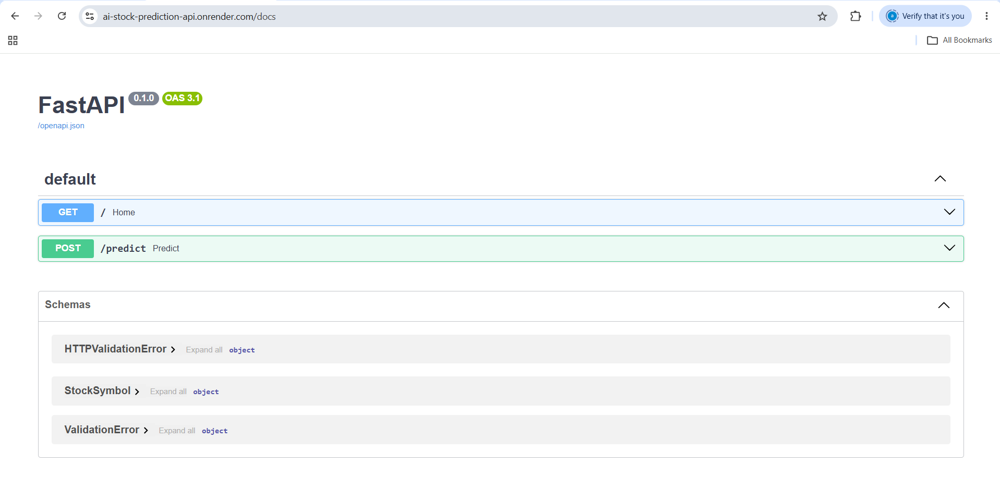
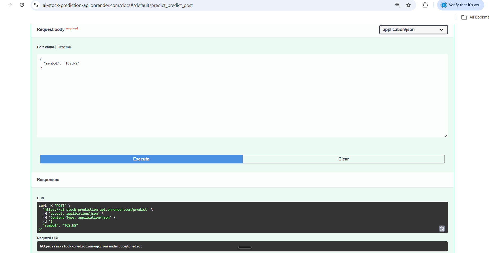
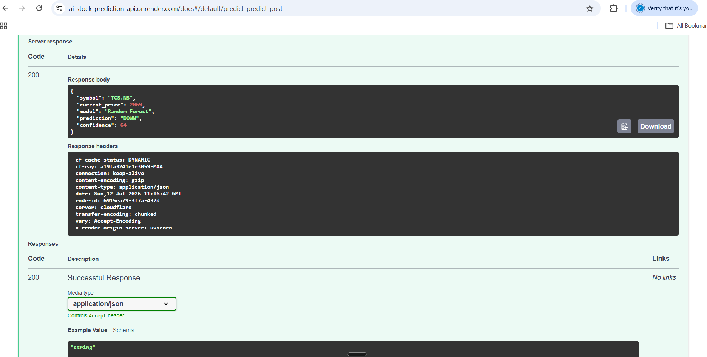
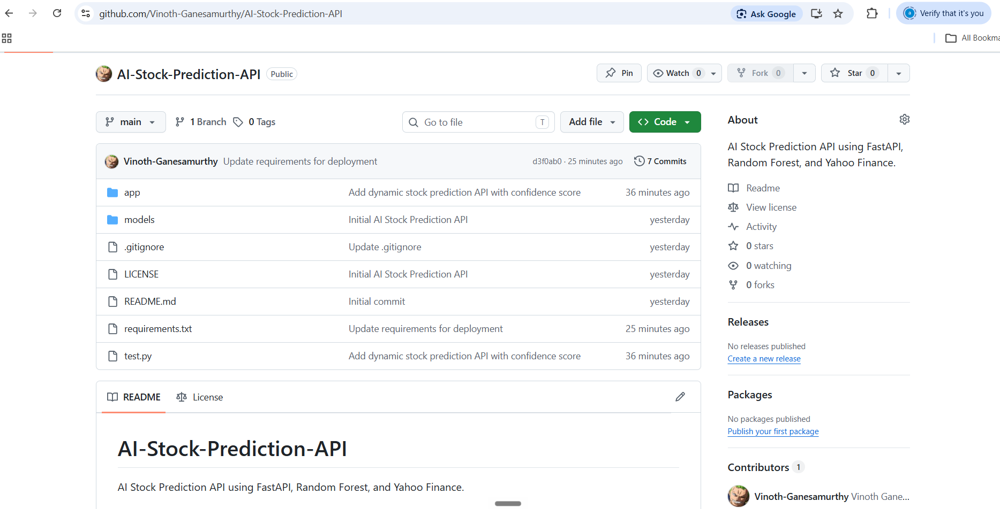
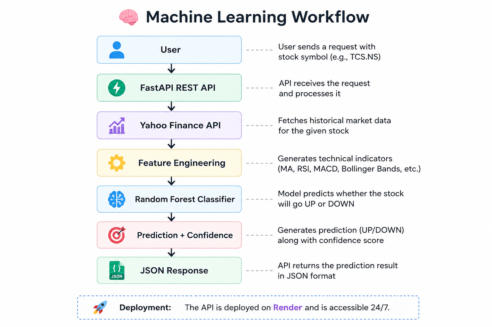

# 📈 AI Stock Prediction API

A Machine Learning REST API built with **FastAPI** that predicts whether a stock is likely to move **UP** or **DOWN** using live market data from Yahoo Finance and a Random Forest model.

---

## 🚀 Live Demo

**API URL**

https://ai-stock-prediction-api.onrender.com

**Swagger Documentation**

https://ai-stock-prediction-api.onrender.com/docs

---

## 📷 Screenshots

### Swagger Documentation



---

### Prediction Request



---

### Prediction Response



---

### GitHub Repository



## ✨ Features

- Live stock data using Yahoo Finance
- Technical indicator feature engineering
- Random Forest machine learning model
- Dynamic stock symbol prediction
- Confidence score for predictions
- REST API built with FastAPI
- Interactive Swagger documentation
- Cloud deployment using Render

---

## 🛠 Tech Stack

- Python
- FastAPI
- Scikit-learn
- Pandas
- NumPy
- yfinance
- Uvicorn
- Git & GitHub
- Render

---

## 📂 Project Structure

```
AI-Stock-Prediction-API
│
├── app
│   ├── main.py
│   ├── predict.py
│   ├── model.py
│   ├── features.py
│   ├── schema.py
│   └── utils.py
│
├── models
│   └── random_forest_model.joblib
│
├── tests
├── requirements.txt
└── README.md
```

---

## ⚙️ Installation

Clone the repository

```bash
git clone https://github.com/Vinoth-Ganesamurthy/AI-Stock-Prediction-API.git
```

Move into the project

```bash
cd AI-Stock-Prediction-API
```

Create a virtual environment

```bash
python -m venv .venv
```

Activate the environment

Windows

```bash
.venv\Scripts\activate
```

Install dependencies

```bash
pip install -r requirements.txt
```

Run the application

```bash
uvicorn app.main:app --reload
```

---

## 📡 API Endpoint

### POST `/predict`

Example Request

```json
{
  "symbol": "TCS.NS"
}
```

Example Response

```json
{
  "symbol": "TCS.NS",
  "current_price": 2069,
  "model": "Random Forest",
  "prediction": "DOWN",
  "confidence": 64
}

```
## 📡 API Endpoint

### POST `/predict`

Example Request

```json
{
  "symbol": "INVALID123.NS"
}
```

Example Response

```json
{
  "error": "No data found for symbol 'INVALID123.NS'."
}
---

## 🧠 Machine Learning Workflow

```

## 🧠 Machine Learning Workflow

<p align="center">
  
</p>

```

## 🌐 Deployment

The API is deployed on Render.

Live URL

https://ai-stock-prediction-api.onrender.com

---

## 🔮 Future Improvements

- LSTM and XGBoost models
- Multiple prediction timeframes
- Candlestick chart visualization
- Portfolio recommendation engine
- Authentication and API keys
- Docker support
- CI/CD pipeline

---

## Key Learning Outcomes

- Built REST APIs with FastAPI
- Integrated live financial data using Yahoo Finance
- Engineered technical indicators (RSI, MACD, Bollinger Bands, Moving Averages)
- Served machine learning predictions using Scikit-learn
- Deployed a production-ready API using Render
- Managed source code with Git and GitHub

---

Disclaimer: This project is intended for educational purposes only. It does not provide financial or investment advice. Predictions are generated using historical market data and machine learning techniques and should not be used as the sole basis for investment decisions.

---

## 👨‍💻 Author

**Vinoth Ganesamurthy**

GitHub:

https://github.com/Vinoth-Ganesamurthy